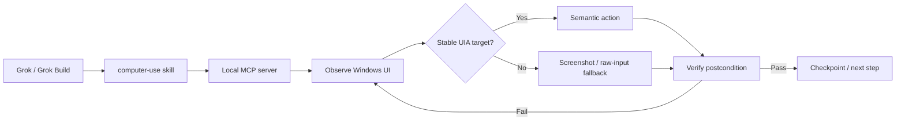

<div align="center">

# Grok Computer Use

**Give Grok a Windows desktop it can observe, control, and verify.**

[](https://github.com/kaihuang1425/grok-computer-use/actions/workflows/ci.yml)
[](https://www.python.org/)
[](https://github.com/kaihuang1425/grok-computer-use)
[](https://modelcontextprotocol.io/)
[](LICENSE)

A local **Model Context Protocol (MCP) server + Grok Build skill** for verification-first Windows computer use.

</div>

> [!IMPORTANT]
> **Alpha research baseline.** The project is usable for controlled experiments, but it does not claim state-of-the-art benchmark results yet. The goal is to make desktop actions more reliable by verifying what actually changed after every meaningful step.

## Why this exists

Most computer-use demos are effectively:

```text
see screenshot → guess target → click → hope it worked
```

Grok Computer Use is built around a different loop:

```text
observe → target semantically → act → verify → recover if needed
```

On Windows, many actions do not need pixel guessing at all. UI Automation can expose a button's label, role, bounds, and automation ID. This project uses that semantic layer first, then falls back to screenshots and raw input only when necessary.

**Design rule:** an action is not success. **Evidence of the expected state is success.**

## Quick start

### Requirements

- Windows 10/11
- Python 3.11 or 3.12
- Grok Build installed and authenticated
- PowerShell

### 1. Clone and install

```powershell
git clone https://github.com/kaihuang1425/grok-computer-use.git
cd grok-computer-use

Set-ExecutionPolicy -Scope Process Bypass
.\scripts\install.ps1
```

The installer creates `.venv`, installs the Windows + development dependencies, and leaves the MCP server isolated inside that project environment.

### 2. Verify Grok can see it

```powershell
grok inspect
grok mcp doctor grok-computer-use
.\.venv\Scripts\python.exe -m pytest -q
```

### 3. Try a real task

Start Grok from the repository root:

```powershell
grok
```

Then try:

```text
/computer-use Open Notepad, type "verification works", save it to C:\Temp\grok-test.txt, and verify the result.
```

Grok Build loads the repo's `.grok/config.toml` and the `computer-use` skill automatically when launched from the project. See the official [Grok MCP documentation](https://docs.x.ai/build/features/mcp-servers) for project-scoped MCP behavior.

## What works today

| Capability | Status | Notes |
| --- | :---: | --- |
| Grok Build project MCP config | ✅ | Local stdio server, repo-scoped |
| Grok `/computer-use` skill | ✅ | Observe → act → verify → recover policy |
| Foreground-window observation | ✅ | Window title, process and UIA controls |
| Semantic Windows UI targeting | ✅ | Find and re-resolve controls by label/role |
| Window discovery + activation | ✅ | Partial title/process matching |
| Screenshot capture | ✅ | Returns the actual image to Grok |
| Coordinate click fallback | ✅ | Used only when semantics are insufficient |
| Unicode text input | ✅ | Clipboard-backed paste with restoration |
| Hotkeys + scrolling | ✅ | Low-level fallback controls |
| Deterministic postcondition verifier | ✅ | Window/UI/process/state-change checks |
| Routing + trajectory primitives | ✅ | Foundations for smarter route selection/evaluation |
| Filesystem/app-specific verification | ◻️ | Planned |
| Browser DOM/CDP execution route | ◻️ | Planned |
| Isolated/non-disruptive worker desktop | ◻️ | Planned |
| Published WindowsWorld benchmark | ◻️ | Planned; no benchmark claim yet |

## How it works



The important part is the final loop. A click that produces no state change is detected instead of silently contaminating the rest of the task.

## Example: verified action

Conceptually, Grok can do this:

```text
observe()

click_control(
  name="Network & internet",
  role="button"
)

verify_state(
  active_window_contains="Settings",
  ui_text_contains="Wi-Fi",
  state_changed=true
)
```

If verification fails, the skill tells Grok to classify the failure and change strategy rather than repeat the same click blindly.

## MCP tools

| Tool | Purpose |
| --- | --- |
| `observe` | Inspect foreground window + semantic UIA controls |
| `list_windows` | List top-level windows and processes |
| `activate_window` | Focus a window by title/process match |
| `open_app` | Launch an executable directly, without a shell |
| `find_controls` | Search controls by visible label / automation ID / role |
| `click_control` | Re-resolve and click one semantic control |
| `screenshot` | Capture the desktop and return an MCP image |
| `click_xy` | Coordinate-click fallback |
| `type_text` | Unicode-capable text input |
| `hotkey` | Send keyboard chords |
| `scroll` | Scroll the foreground UI |
| `verify_state` | Check explicit postconditions after an action |

## Why semantic targeting matters

A pixel-based agent may remember:

```text
"Save" was at (910, 442)
```

Then the window moves, the layout changes, or a dialog opens.

Grok Computer Use instead tries to remember the target as:

```text
role = button
name = Save
```

and re-resolves that control immediately before clicking it. Coordinates remain available, but as a fallback rather than the default abstraction.

## Verification strategy

The project deliberately separates **action execution** from **success judgment**.

A verifier can currently check things such as:

- active-window title
- visible UI text
- control role
- whether a process is running
- whether observable state changed at all

The next step is extending verification beyond visible UI state to files, application data, browser state, and cross-app artifacts.

See [`docs/VERIFICATION.md`](docs/VERIFICATION.md) for the evaluation contract.

## Benchmarks: no fake SOTA claims

The repository currently validates core routing/verifier behavior in CI on:

- Ubuntu + Python 3.11
- Ubuntu + Python 3.12
- Windows + Python 3.11
- Windows + Python 3.12
- Windows adapter import with the full Windows extras installed

That is engineering validation, **not a computer-use benchmark**.

The benchmark plan is intentionally staged:

1. deterministic local Windows task suite
2. ablation: screenshot-only vs UIA vs UIA + verification/recovery
3. WindowsWorld, with special focus on 3+ application workflows
4. held-out verifier-quality evaluation to measure false-success rate

Until those runs exist, this README will not advertise a benchmark number.

## Roadmap

- [ ] Filesystem-aware and app-specific postconditions
- [ ] Browser DOM/CDP execution route
- [ ] Persistent cross-app checkpoint evidence
- [ ] Better failure classification and route switching
- [ ] Permission profiles for sensitive applications/actions
- [ ] Isolated worker desktop / VM execution so Grok does not take over the user's active pointer
- [ ] Reproducible WindowsWorld evaluation
- [ ] Optional specialist visual grounding fallback

## Security

This MCP can generate real mouse, keyboard, clipboard and application-launch actions.

- Keep it local over stdio.
- Do not expose the computer-control server directly to the public internet.
- Prefer a dedicated Windows account or VM for unfamiliar workflows.
- Do not grant administrator privileges by default.
- Stop on unexpected UAC, credential, payment or privacy-sensitive dialogs.
- Treat raw coordinate input as a fallback, not the primary control surface.

Read [`SECURITY.md`](SECURITY.md) before expanding permissions.

## Project layout

```text
.grok/
  config.toml                    project-scoped MCP registration
  skills/computer-use/SKILL.md   Grok behavior and recovery policy
src/grok_cua/
  server.py                      MCP tool surface
  adapters/windows.py            UIA + screenshots + input
  core/router.py                 route-scoring primitives
  core/verifier.py               postcondition verification
  core/trace.py                  JSONL trajectory primitive
tests/                           routing + verifier tests
eval/                            evaluation task fixtures
docs/                            architecture, competition, verification
```

## Design references

This project is not a clone of one system. It combines ideas that work well across several computer-use approaches:

- [Grok Build MCP servers](https://docs.x.ai/build/features/mcp-servers) — project-scoped local tools
- [Grok Build skills](https://docs.x.ai/build/features/skills-plugins-marketplaces) — agent behavior and invocation policy
- [Anthropic Computer Use quickstart](https://github.com/anthropics/claude-quickstarts/tree/main/computer-use-demo) — visual observe/action loop
- [Codex Computer Use](https://developers.openai.com/codex/computer-use) — tool routing and permission-oriented product design
- [Microsoft UFO](https://github.com/microsoft/UFO) — Windows-native semantic automation
- [Agent S](https://github.com/simular-ai/Agent-S) — computer-agent architecture and evaluation

See [`docs/COMPETITION.md`](docs/COMPETITION.md) for the product thesis.

## Contributing

Reliability improvements are more valuable than simply adding more actions. New state-changing capabilities should include an observable success condition and tests where practical.

See [`CONTRIBUTING.md`](CONTRIBUTING.md).

## License

MIT © 2026 I-Kai Huang. See [`LICENSE`](LICENSE).
